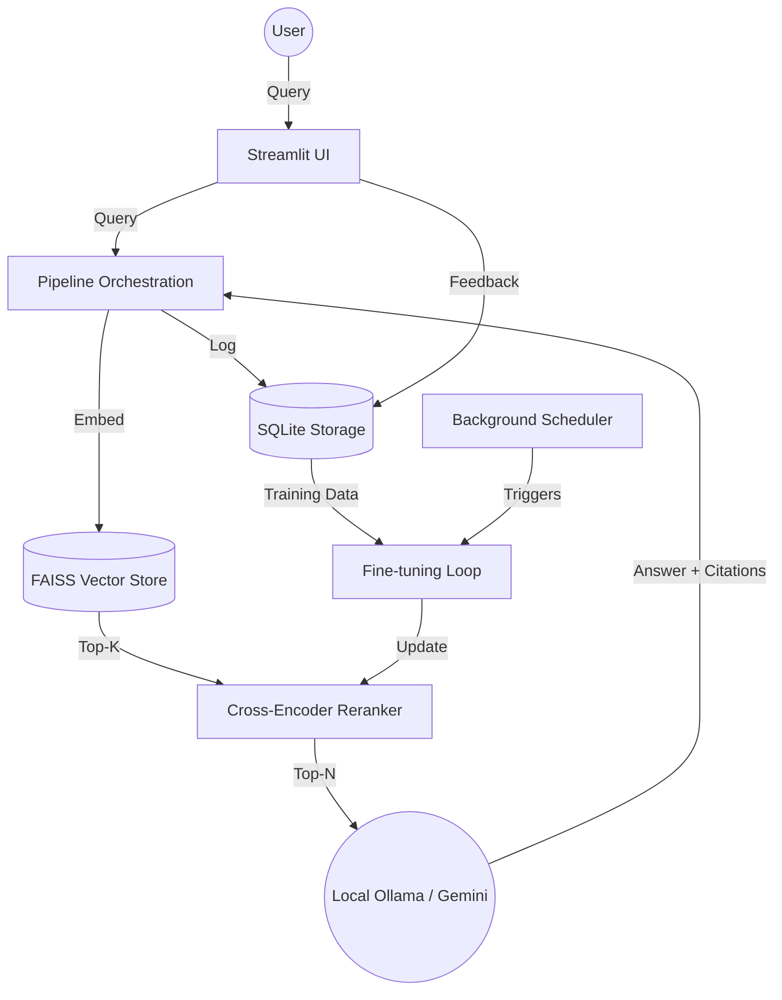

# 🚀 Self-Improving RAG (Retrieval-Augmented Generation)

A production-grade RAG system that autonomously enhances its retrieval precision by fine-tuning a Cross-Encoder reranker based on real-time user feedback.

## 🌟 Key Features
- **Hybrid Retrieval Engine**: Seamlessly combines Dense (FAISS) and Sparse (BM25) search using Reciprocal Rank Fusion (RRF).
- **Dual-Model Support**: Support for cloud-scale LLMs (**Gemini 1.5 Pro/Flash**) and local inference via **Ollama**.
- **Automated Self-Improvement**: A background scheduler triggers fine-tuning loops once a feedback threshold (e.g., 50 signals) is reached.
- **Advanced Reranking**: Utilizes `SentenceTransformers` for high-precision document sorting, automatically updated by the training pipeline.
- **Smart Feedback Loop**: Captures explicit (thumbs up/down) and implicit (dwell time, citation clicks) signals to build high-quality training sets.
- **Experiment Tracking**: Built-in A/B testing framework to compare performance between different reranker versions.
- **Modern UI**: Streamlit-based interface for interactive chat, document ingestion, and real-time performance metrics.

## 🏗️ Architecture


## 🚀 Quick Start

### 1. Prerequisites
- Python 3.10+
- [Ollama](https://ollama.com/) (Optional, for local generation)
- [Google AI Studio API Key](https://aistudio.google.com/app/apikey) (Optional, for Gemini support)

### 2. Installation
```bash
git clone https://github.com/Sufiyan78666/-self_improving_rag.git
cd -self_improving_rag
pip install -r requirements.txt
```

### 3. Environment Setup
Create a `.env` file in the root directory:
```env
GOOGLE_API_KEY="your_gemini_key"
LLM_PROVIDER="gemini" # or "ollama" / "nvidia"
LLM_MODEL="gemini-2.5-flash"
OLLAMA_BASE_URL="http://localhost:11434"
NVIDIA_API_KEY="your_nvidia_key"
GROQ_API_KEY="your_groq_key"
LANGSMITH_API_KEY="your_langsmith_key"
LANGSMITH_PROJECT="self-improving-rag"
OCR_ENABLED="true"
TESSERACT_CMD="C:\\Program Files\\Tesseract-OCR\\tesseract.exe"
OCR_DPI=200
```

### 4. Run the Application
The system consists of two main components:

**Start the UI:**
```bash
python run.py ui
```

#### OCR Notes (PDF scans)
- Install Tesseract OCR and set `TESSERACT_CMD` in `.env` (Windows example above).
- PyMuPDF is used for OCR rendering by default (no Poppler needed).
- Poppler is only required if you want to use the `pdf2image` fallback.

**Start the Background Scheduler (Automatic Training):**
```bash
python run.py schedule
```

## 📈 Training & Self-Improvement
The system automatically monitors the feedback database (`data/rag.db`). When the `FEEDBACK_THRESHOLD` is met, the system:
1.  Extracts query-document pairs.
2.  Labels them based on feedback scores (0 to 1).
3.  Fine-tunes the current Cross-Encoder.
4.  Evaluates the new model against the baseline.
5.  Deploys the new model if it shows a performance gain (NDCG@K improvement).

To manually trigger a training run:
```bash
python run.py train
```

## 🛠️ Project Structure
- `core/`: Main orchestration logic and configuration.
- `retrieval/`: FAISS, BM25, and hybrid search implementation.
- `reranker/`: Model inference and registry for Cross-Encoders.
- `generation/`: Multi-provider LLM support (Gemini, Ollama).
- `feedback/`: Signal capture and score aggregation.
- `training/`: Automated fine-tuning and evaluation logic.
- `storage/`: Database schemas and async query handlers.
- `ui/`: Streamlit components and data visualization.

## 🧪 Testing
Run the comprehensive test suite:
```bash
pytest
```
