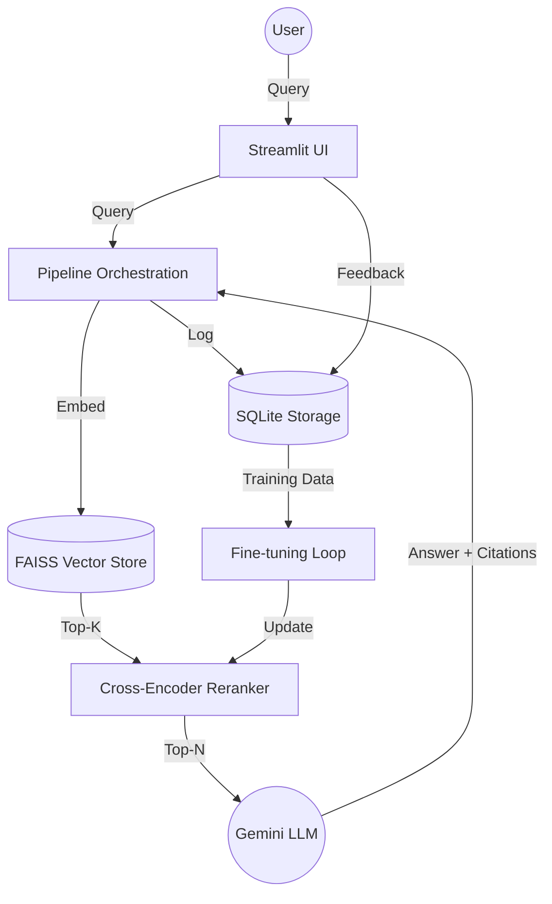

# Self-Improving RAG (Retrieval-Augmented Generation)

A production-quality RAG system that automatically improves its retrieval performance by fine-tuning a cross-encoder reranker based on user feedback signals.

## 🌟 Key Features
- **Hybrid Search**: Combines Dense (FAISS) and Sparse (BM25) retrieval using Reciprocal Rank Fusion (RRF).
- **Advanced Reranking**: Integrates `SentenceTransformers` Cross-Encoders for high-precision sorting.
- **LLM Generation**: Async integration with **Gemini 1.5 Pro** for grounded answers with citations.
- **Smart Feedback Loop**: Collects thumbs up/down, citation clicks, and dwell time, aggregating them into relevance scores.
- **Self-Improvement**: Nightly fine-tuning loop that trains the reranker on user-provided feedback data.
- **Interactive UI**: Built with Streamlit for chat, document ingestion, and metrics visualization.

## 🏗️ Architecture


## 🚀 Quick Start

### 1. Prerequisites
- Python 3.10+
- [Google AI Studio API Key](https://aistudio.google.com/app/apikey)

### 2. Installation
```bash
git clone <repo-url>
cd self_improving_rag
pip install -r requirements.txt
```

### 3. Environment Setup
Create a `.env` file from the example:
```bash
cp .env.example .env
```
Open `.env` and add your Gemini API key:
```text
GOOGLE_API_KEY="your_api_key_here"
```

### 4. Run the Application
```bash
python run.py ui
```
Then open your browser at `http://localhost:8501`.

## 📈 Training & Improvement
The system collects feedback in `data/rag.db`. To manually trigger the fine-tuning process:
```bash
python run.py train
```
The trainer will only run if a minimum threshold of feedback events (default: 10) has been collected.

## 🧪 Testing
Run the integration suite:
```bash
pytest tests/
```

## 🛠️ Project Structure
- `core/`: Config, exceptions, and main pipeline.
- `storage/`: SQLite schema, migrations, and async queries.
- `retrieval/`: FAISS vector store, ingestion, and embedding.
- `reranker/`: Cross-Encoder inference and model management.
- `generation/`: Gemini API, prompts, and citation mapping.
- `feedback/`: Capture, validation, and signal processing.
- `training/`: Dataset prep, trainer, and nightly scheduler.
- `evaluation/`: IR metrics (NDCG, MRR) and experiment tracking.
- `ui/`: Streamlit chat application.
